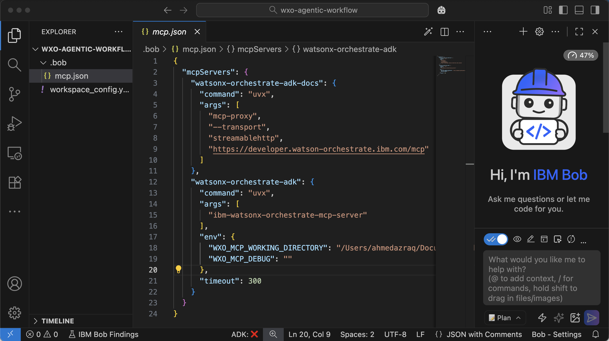
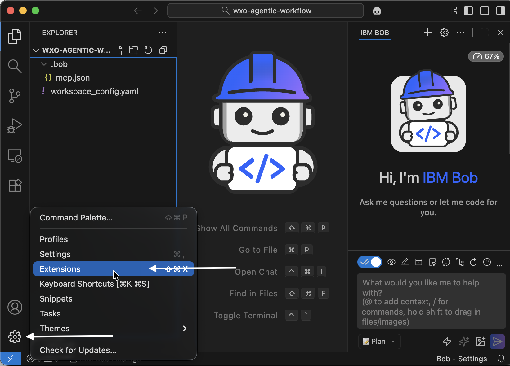
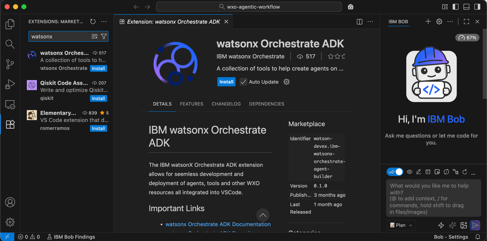
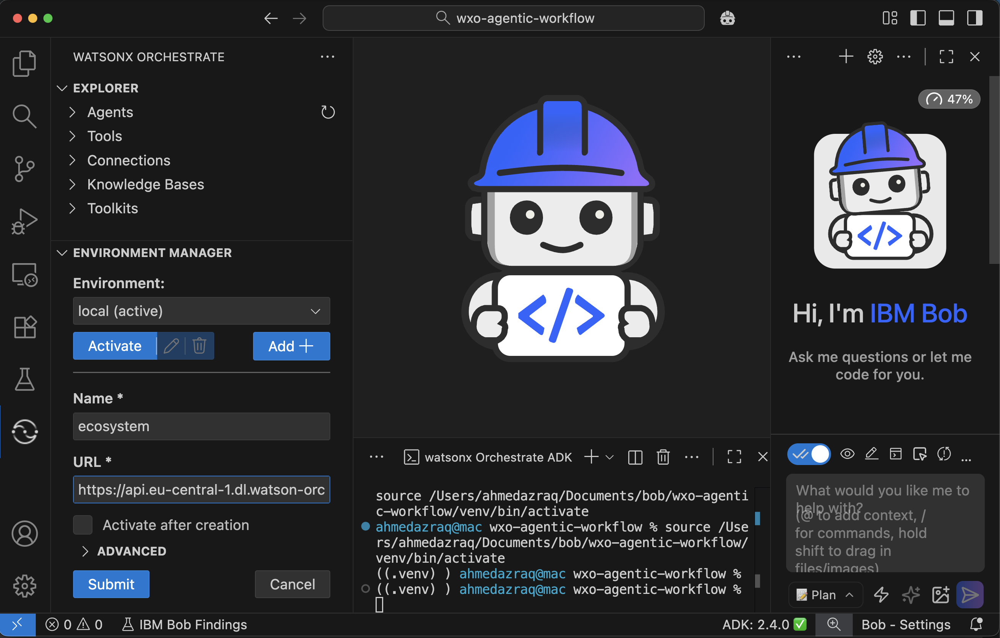
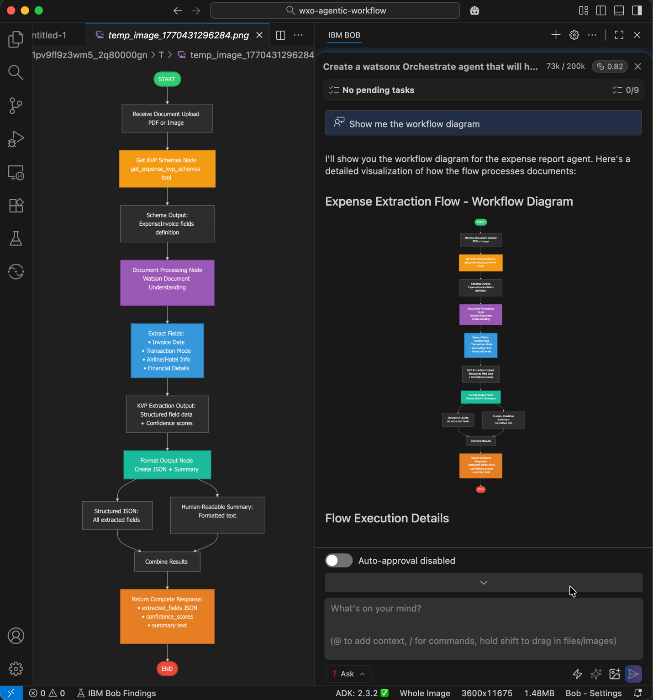

# Hands-on Lab: Build and Deploy Airline Invoice Processing Agent

## Lab Overview

**Duration**: ~40 minutes  
**Level**: Advanced   
**Prerequisites**: watsonx Orchestrate instance, IBM Bob IDE installed

## Objective
Build a watsonx Orchestrate agent that processes airline invoice documents (PDF/image), extracts structured data using Watson Document Understanding, and deploys it to watsonx Orchestrate.

---

## Step 1: Open Directory and Create Project Folder

**Create your project workspace folder:**

1. Open **IBM Bob IDE**

2. Go to **File → Open Folder** 

3. Navigate to the directory where you want to create your project (e.g., your Desktop or Documents folder)

4. Create a new folder named **`WXO-AGENTIC-WORKFLOW`**:
   - **Windows**: Right-click in the file explorer → **New → Folder**, name it `WXO-AGENTIC-WORKFLOW`
   - **macOS / Linux**: Click **New Folder** in the dialog, name it `WXO-AGENTIC-WORKFLOW`

5. Select the `WXO-AGENTIC-WORKFLOW` folder and click **Open**

IBM Bob now has `WXO-AGENTIC-WORKFLOW` as the active workspace root. All subsequent files and folders created in this lab will be placed inside this directory.

---

## Step 2: Setup

**Configure Access to watsonx Orchestrate MCP Servers:**

Configure Bob to access watsonx Orchestrate MCP servers for ADK documentation and direct ADK commands.


1. **Create a new folder called `.bob`. Add a file called `mcp.json`** in the .bob folder with the following configuration:

```json
{
  "mcpServers": {
    "watsonx-orchestrate-adk-docs": {
      "command": "uvx",
      "args": [
        "mcp-proxy",
        "--transport",
        "streamablehttp",
        "https://developer.watson-orchestrate.ibm.com/mcp"
      ]
    },
    "watsonx-orchestrate-adk": {
      "command": "uvx",
      "args": [
        "ibm-watsonx-orchestrate-mcp-server"
      ],
      "env": {
        "WXO_MCP_WORKING_DIRECTORY": "C:\\Users\\YourName\\path\\to\\project",
        "WXO_MCP_DEBUG": ""
      },
      "timeout": 300
    }
  }
}
```



2. **Update `WXO_MCP_WORKING_DIRECTORY`** in mcp.json with your actual project path

3. Click on the "settings" Icon in the top right corner of Bob. Select the "MCP" tab and check if the MCP servers are there. You should see these 2 servers with a green status light:
    - watsonx-orchestrate-adk
    - watsonx-orchestrate-adk-docs`

4. If the MCP servers are not showing up, **Reload Bob IDE** and verify both MCP servers are connected. To do this, you can click "Ctrl + Shift + P" and search for "reload window"

---

## Step 3: Install watsonx Orchestrate ADK Extension

**Install and Configure ADK Extension:**

- Click **Manage** in lower-left pane → **Extensions**
- Search for `watsonx Orchestrate ADK` and click **Install**




- **Create Python Virtual Environment**:

  Open a terminal in your project root and run the appropriate commands for your OS:

  **macOS / Linux:**
  ```bash
  python3.12 -m venv venv
  source venv/bin/activate
  ```

  **Windows (Command Prompt):**
  ```cmd
  py -3.12 -m venv venv
  venv\Scripts\activate.bat
  ```

  **Windows (PowerShell):**
  ```powershell
  py -3.12 -m venv venv
  venv\Scripts\Activate.ps1
  ```

  > **Note:** If `python3.12` / `py -3.12` is not found, ensure Python 3.12 is installed and on your PATH. You can verify with `python3 --version` (Mac/Linux) or `py --list` (Windows).

- **Initialize Workspace**:
  - Click watsonx logo tile in left sidebar → **Initialize Workspace**

- **Configure Environment**:
  - In **Environment Manager**, click **Add +**
  - Enter environment name (e.g., `agents-with-bob`) and service URL
  - Click **Submit**



- **Activate Environment**:
  - Select environment → **Activate** → Enter API key when prompted

---
## Step 4: Create Bob Rule for watsonx Orchestrate Best Practices

**Create Development Rule:**

Create a Bob rule that captures best practices for watsonx Orchestrate ADK development. This rule ensures Bob follows correct patterns when planning tasks, writing code, or using advanced features.   
 
Bob Rules:
- Provide clear semantics about watsonx Orchestrate agents
- Include examples of correct ADK usage
- Define standard flow patterns
- Document expected CLI operations
- Enforce constraints specific to watsonx Orchestrate

**Setup:**

The guidance is separated into two files:

1. **Save Implementation Guide** (`wxo-implementation-guide.md` in root directory):
   - This is a detailed reference guide Bob can request when needed.
   - Download [wxo-implementation-guide.md](https://raw.githubusercontent.com/IBM/oic-i-agentic-ai-tutorials/refs/heads/main/bob-wxo-dev/wxo-implementation-guide.md)
   - Save to workspace root directory

2. **Create Rules Directory** in the `.bob` folder

3. **Create Development Rule** (`.bob/rules/wxo-development.md`):
   - This is a concise, always-on rule automatically applied across all modes
   - Create `.bob/rules/wxo-development.md`
   - Copy content from [wxo-development.md](https://github.com/IBM/oic-i-agentic-ai-tutorials/blob/main/bob-wxo-dev/.bob/rules/wxo-development.md)
   - Save the file

---


## Step 5: Create Implementation Plan and Agent Design

Give Bob clear, specific prompts to create the implementation plan and agent architecture. The quality of your prompts affects Bob's output.

**Settings:**
- Use **Plan mode** 📝
- Keep **auto-approve OFF** to review each step

**Provide Bob with the agent requirements:**

```
Follow the file @/.bob/rules/wxo-implementation-guide.md 
Create a watsonx Orchestrate agent and agentic flow to process airline invoice documents (PDF or image).

The agent should:
1. Accept an uploaded document file
2. Extract key structured fields using Watson Document Understanding (docproc node and validated with KVP schema)
3. Return the output in structured JSON format

Required Fields to Extract:

**Invoice Information:**
- Invoice Date
- Transaction Mode (e.g., Credit Card, UPI, Bank Transfer, Cash)
- Ticket Number

**Airline and Passenger Information:**
- Airline Name
- Passenger Name
- Ticket Date
- Flight Details

**Fee Information:**
- Base Fare / Charges
- Taxes (with breakdown if available)
- Total Amount
- Currency
```

<font color="red">Need to check if the implemenation guide needs to be updated</font>


Based on the Bob rule, Bob requests access to read `wxo-implementation-guide.md` to follow best practices. Bob may also request access to other files if needed. Click **Approve**.

Bob then requests access to watsonx Orchestrate ADK documentation MCP server to gather more context. Bob shares the task list afterward. Review the task list and click **Approve**.

---

Bob may ask questions about the structure. Choose answers that match the simple approach:
- One flow
- Default models
- Include only the import script
- Use SaaS version

Bob generates the implementation plan, architecture design, and workflow design. 

**Note:** *If Bob asks to switch modes, ignore and continue. You can terminate the task once the diagrams are generated*

Switch to **Ask mode** and ask Bob: `Show me the workflow diagram`. To view the Mermaid diagram, install the Mermaid extension if needed.




---

## Step 6. Implement the agent and the agentic workflow

Ask Bob to generate the code and configuration needed to build the agent. Bob creates an agent, creates the invoice processing flow, generates the OCR and extraction tools, defines the schemas and steps, and assembles the workflow according to watsonx Orchestrate implementation rules.

**Note:** Review the generated code carefully to confirm it matches your intended functions and requirements.

- Switch to **Advanced mode** 🛠️ so Bob can access the two watsonx Orchestrate MCP servers.

- Give Bob the instructions to create the agent, then review the plan and click **Approve**.

```
Implement based on the approved plan and follow the below instructions:

**Requirements:**
1. Create a native agent with this specific LLM model: groq/openai/gpt-oss-120b
2. Build a document processing flow using Watson Document Understanding (docproc node)
3. Define a KVP schema for the fields I need to extract.
4. For simplicity include the KVP schema inline in the flow file.
4. Ensure all imports are relative (using dot notation)

**Important Implementation Details:**
- Use plain functions for schema helpers (no @tool decorator)
- Use relative imports in all Python files
- Keep the flow simple with just a docproc node
- Use native agent type for better document handling
- Use JSON output format (not file reference)
- Use WXO ADK MCP and WXO doc MCP
```

**What to expect from Bob:**
- Creates checkpoints so you can roll back to earlier versions if needed
- Creates the flow → Review the code and continue
- Creates the agent YAML file with configuration
- Creates a script to import the workflow and agent to watsonx Orchestrate
- Creates test script and documentation
- Verifies and confirms the implementation is complete


---

## Step 7. Deploy & Verify the agentic workflow and the agent

Ask Bob to deploy the agentic workflow tool and agent YAML file by importing the script that Bob created in the previous step.

Click the watsonx tile on the left sidebar.

In the Environment Manager, configure access to your watsonx Orchestrate environment and click **Activate**. Enter your API key when the system prompts you. You already configured this environment in Step 2. You may need to reactivate it.


Give Bob the deployment instruction:

```
Run the import script to deploy the flow and agent to my watsonx Orchestrate environment.
If orchestrate command line is not installed, install ibm-watsonx-orchestrate with pip.
```

Bob runs the import script to deploy the workflow and the agent.

**Verify Deployment and Test Agent:**

Confirm that the agentic workflow created by Bob works correctly in watsonx Orchestrate.

1. **Log in to watsonx Orchestrate**
   - Navigate to your watsonx Orchestrate instance
   - Go to **Manage Agents**
   - Search for the agent named `expense_report_agent` created by Bob

2. **Verify Configuration**
   - Confirm that the agentic workflow is attached to the agent
   - Verify that the agent uses the **Groq-GPT-OSS 120B** model

3. **Test the Agent**
   - In watsonx Orchestrate, open the chat interface
   - Type: `Extract my invoices details from sample-flight-invoice.pdf`
   - The agent prompts you to upload a PDF. Download <a href="https://github.com/IBM/oic-i-agentic-ai-tutorials/blob/main/bob-wxo-dev/sample-pdfs/sample-flight-invoice.pdf"> this PDF here</a>
   - Upload the sanitized PDF that Bob created

4. **Review Results**
   - The agent returns all extracted invoice details
